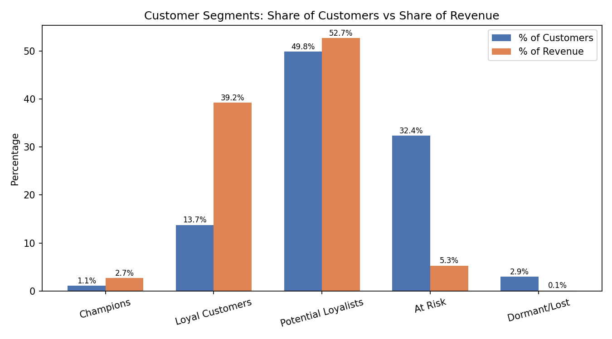

# Bank Customer Segmentation — RFM Analysis

A customer segmentation project on ~1M transactions from an Indian bank, built to answer a real business decision-support question: **which customers should this bank invest in retaining, and which segments need a different strategy entirely?**



## Business Question

> **Which customer segments drive the most value for the bank, and how should marketing/retention strategy differ across them?**

This isn't a clustering exercise for its own sake — it's meant to answer a question a bank's marketing or retention team would actually ask before allocating budget.

## Sub-Questions

1. Who are our customers? (age, gender, geographic distribution)
2. What does spending behavior look like? (frequency, transaction amount, account balance)
3. Which segments exist? (RFM-based segmentation)
4. Which segment is most valuable, and which is most at-risk?
5. Are there regional or demographic patterns worth targeting?

## Tech Stack & Pipeline

| Stage | Tool | What happened |
|---|---|---|
| Data cleaning & aggregation | **MySQL** | Loaded ~1.05M raw transactions, cleaned malformed dates/genders/locations, calculated Age, aggregated to one row per customer with Recency/Frequency/Monetary |
| Segmentation logic | **Excel** | Quintile-scored R/F/M, combined into a total RFM score, mapped to 5 business-friendly segment labels, built pivot summaries |
| Dashboard | **Power BI** | Interactive dashboard with KPI cards, segment breakdown, and revenue distribution |

**Note on sampling:** all data cleaning and RFM calculation was performed on the full ~1.05M-row transaction dataset in MySQL. For the Excel scoring and Power BI dashboard layers, a random sample of 100,000 unique customers (~98,242 after cleaning) was used to keep the analysis performant on consumer hardware. This is a standard, disclosed trade-off — not a shortcut that changes the conclusions, since the sample is large enough to be statistically representative.

## Repository Structure

```
├── README.md                          # This file
├── ANALYSIS.md                        # Full findings report, sub-question by sub-question
├── sql/
│   └── Bank_Segmentation.sql          # Full cleaning + RFM aggregation pipeline
├── excel/
│   └── Customer_RFM.xlsx              # RFM scoring, segment labels, pivot tables
├── powerbi/
│   └── Bank_Segmentation_Dashboard.pbix
└── assets/
    └── segment_value_chart.png
```

## Key Finding (headline)

**13.7% of customers (Loyal Customers) generate 39.2% of revenue** — the single highest average revenue per customer of any segment. Meanwhile, **49.8% of customers (Potential Loyalists) already contribute 52.7% of revenue** but haven't converted into repeat, high-frequency relationships. Together, these two segments represent **~92% of total revenue from ~64% of customers** — this is where retention and upsell budget should concentrate.

Full findings, segment-by-segment breakdowns, and business recommendations are in **[ANALYSIS.md](ANALYSIS.md)**.

## Data Source

[Bank Customer Segmentation dataset](https://www.kaggle.com/datasets/shivamb/bank-customer-segmentation) — Kaggle, transaction-level data from an Indian bank.

## Important Data Limitations (disclosed for transparency)

- **The dataset covers only ~3 months (Aug 1 – Oct 21, 2016).** This means "Frequency" reflects transactions observed in a short window, not lifetime purchase behavior — 98.3% of customers show exactly 1 transaction in this period. RFM segmentation here is effectively driven more heavily by Recency and Monetary value than Frequency; a longer observation window would materially improve Frequency's discriminative power. This is flagged explicitly in the analysis rather than glossed over.
- ~9.6% of customers have missing/unparseable Date of Birth (and therefore no Age); these were kept in the dataset with Age treated as missing rather than dropped, so as not to lose real transaction records.
- ~0.09% of records have missing Gender, retained and labeled "Unknown" rather than dropped.
- A random 100K-customer sample was used for scoring/dashboarding (see note above).

